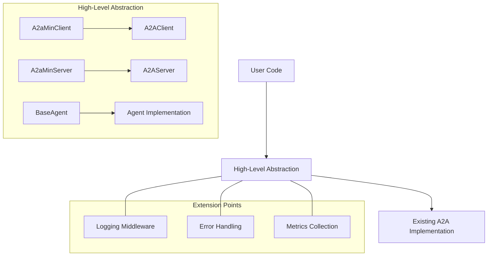
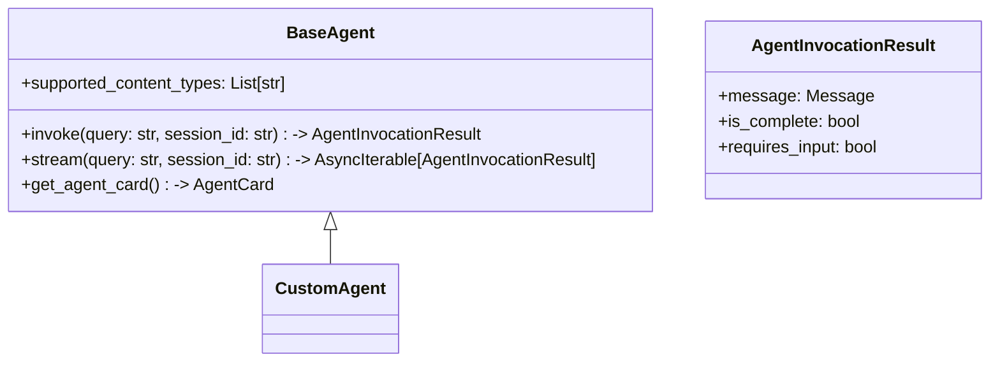
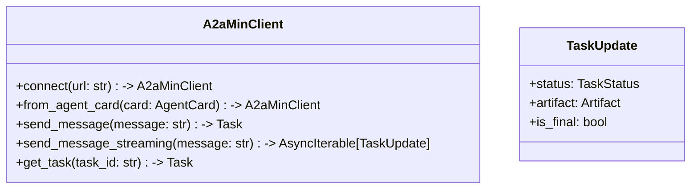
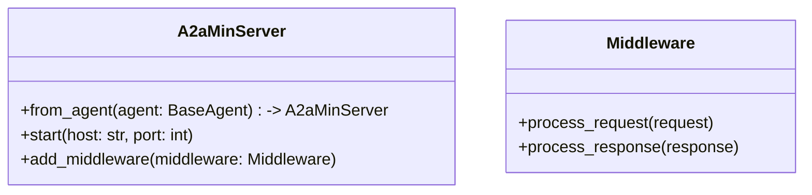

# A2A Min: Improved Abstraction Design

This document outlines a new abstraction layer for the A2A Min client-server architecture, designed to simplify usage while maintaining the existing functionality and types.

## Core Design Principles

1. **Simplicity**: Make client and server creation a one-liner when possible
2. **Type Safety**: Build on existing types and use Pydantic for strong typing
3. **Extensibility**: Create clear extension points for logging, debugging, etc.
4. **Optional Features**: Make streaming and push notifications optional but easy to enable
5. **Consistent Naming**: Align method names with current type names
6. **Reuse Existing Types**: Leverage the current type system rather than reinventing the wheel

## Architecture Overview



## Key Components

### 1. Agent Interface



### 2. Client Abstraction



### 3. Server Abstraction



## Implementation Details

### 1. New Types

We'll create a few new Pydantic models to support the abstraction:

```python
from pydantic import BaseModel
from typing import List, Optional, Any, Dict
from a2a_min.types import Message, Part, TaskState, Artifact

class AgentInvocationResult(BaseModel):
    """Result of an agent invocation."""
    message: Message
    is_complete: bool = True
    requires_input: bool = False
    metadata: Optional[Dict[str, Any]] = None

class TaskUpdate(BaseModel):
    """An update from a streaming task."""
    status: Optional[TaskState] = None
    artifact: Optional[Artifact] = None
    is_final: bool = False
    metadata: Optional[Dict[str, Any]] = None
```

### 2. Agent Interface

We'll create a `BaseAgent` abstract class that defines the interface for all agents, using the existing types:

```python
from abc import ABC, abstractmethod
from typing import AsyncIterable, List, Optional, Dict, Any
from a2a_min.types import AgentCard, AgentCapabilities, AgentSkill, Message, Part, TextPart
from .types import AgentInvocationResult

class BaseAgent(ABC):
    """Base class for all agents.
    
    This class defines the interface that all agents must implement.
    """
    
    @property
    def name(self) -> str:
        """Return the name of the agent."""
        return self.__class__.__name__
    
    @property
    def description(self) -> str:
        """Return a description of the agent."""
        return "A generic agent"
    
    @property
    def supported_content_types(self) -> List[str]:
        """Return the content types supported by this agent."""
        return ["text"]
    
    @property
    def capabilities(self) -> AgentCapabilities:
        """Return the capabilities of this agent."""
        return AgentCapabilities(
            streaming=hasattr(self, "stream") and callable(getattr(self, "stream")),
            pushNotifications=False,
            stateTransitionHistory=False
        )
    
    @property
    def skills(self) -> List[AgentSkill]:
        """Return the skills of this agent."""
        return [
            AgentSkill(
                id=f"{self.name.lower()}_skill",
                name=self.name,
                description=self.description,
                tags=[],
                examples=[]
            )
        ]
    
    def get_agent_card(self, url: str = "http://localhost:8000/") -> AgentCard:
        """Generate an agent card for this agent.
        
        Args:
            url: The URL where the agent is hosted.
            
        Returns:
            An AgentCard instance describing this agent.
        """
        return AgentCard(
            name=self.name,
            description=self.description,
            url=url,
            version="1.0.0",
            capabilities=self.capabilities,
            skills=self.skills,
            defaultInputModes=self.supported_content_types,
            defaultOutputModes=self.supported_content_types
        )
    
    @abstractmethod
    def invoke(self, query: str, session_id: str) -> AgentInvocationResult:
        """Synchronously process a query and return a response.
        
        Args:
            query: The user's query.
            session_id: A unique identifier for the session.
            
        Returns:
            An AgentInvocationResult containing the agent's response.
        """
        pass
    
    async def stream(self, query: str, session_id: str) -> AsyncIterable[AgentInvocationResult]:
        """Stream a response to a query.
        
        Default implementation yields the invoke result.
        
        Args:
            query: The user's query.
            session_id: A unique identifier for the session.
            
        Yields:
            AgentInvocationResult objects containing parts of the agent's response.
        """
        yield self.invoke(query, session_id)
```

### 3. Client Abstraction

We'll create an `A2aMinClient` class that simplifies the client-side interaction:

```python
from typing import AsyncIterable, Optional, List
from uuid import uuid4
from a2a_min.types import (
    AgentCard, Task, TaskState, Message, TextPart, 
    TaskSendParams, TaskQueryParams, TaskStatusUpdateEvent,
    TaskArtifactUpdateEvent
)
from a2a_min.client.card_resolver import A2ACardResolver
from a2a_min.client.client import A2AClient
from .types import TaskUpdate

class A2aMinClient:
    """A simplified client for interacting with A2A servers."""
    
    def __init__(self, client: A2AClient):
        """Initialize the client.
        
        Args:
            client: The underlying A2AClient instance.
        """
        self._client = client
    
    @classmethod
    def connect(cls, url: str) -> "A2aMinClient":
        """Connect to an A2A server at the given URL.
        
        Args:
            url: The URL of the A2A server.
            
        Returns:
            An A2aMinClient instance connected to the server.
        """
        resolver = A2ACardResolver(url)
        card = resolver.get_agent_card()
        return cls.from_agent_card(card)
    
    @classmethod
    def from_agent_card(cls, card: AgentCard) -> "A2aMinClient":
        """Create a client from an agent card.
        
        Args:
            card: The agent card describing the server.
            
        Returns:
            An A2aMinClient instance configured with the agent card.
        """
        client = A2AClient(agent_card=card)
        return cls(client)
    
    async def send_message(
        self, 
        message: str, 
        session_id: Optional[str] = None,
        task_id: Optional[str] = None,
        accepted_output_modes: Optional[List[str]] = None
    ) -> Task:
        """Send a message to the agent and get a response.
        
        Args:
            message: The message to send.
            session_id: An optional session ID. If not provided, a new one will be generated.
            task_id: An optional task ID. If not provided, a new one will be generated.
            accepted_output_modes: Optional list of accepted output modes.
            
        Returns:
            A Task object containing the agent's response.
        """
        if session_id is None:
            session_id = uuid4().hex
        
        if task_id is None:
            task_id = uuid4().hex
        
        if accepted_output_modes is None:
            accepted_output_modes = ["text"]
        
        message_obj = Message(
            role="user", 
            parts=[TextPart(text=message)]
        )
        
        params = TaskSendParams(
            id=task_id,
            sessionId=session_id,
            message=message_obj,
            acceptedOutputModes=accepted_output_modes
        )
        
        response = await self._client.send_task(params)
        return response.result
    
    async def send_message_streaming(
        self, 
        message: str, 
        session_id: Optional[str] = None,
        task_id: Optional[str] = None,
        accepted_output_modes: Optional[List[str]] = None
    ) -> AsyncIterable[TaskUpdate]:
        """Send a message to the agent and get a streaming response.
        
        Args:
            message: The message to send.
            session_id: An optional session ID. If not provided, a new one will be generated.
            task_id: An optional task ID. If not provided, a new one will be generated.
            accepted_output_modes: Optional list of accepted output modes.
            
        Yields:
            TaskUpdate objects containing parts of the agent's response.
        """
        if session_id is None:
            session_id = uuid4().hex
        
        if task_id is None:
            task_id = uuid4().hex
        
        if accepted_output_modes is None:
            accepted_output_modes = ["text"]
        
        message_obj = Message(
            role="user", 
            parts=[TextPart(text=message)]
        )
        
        params = TaskSendParams(
            id=task_id,
            sessionId=session_id,
            message=message_obj,
            acceptedOutputModes=accepted_output_modes
        )
        
        async for update in self._client.send_task_streaming(params):
            if hasattr(update.result, "status"):
                status_update = update.result
                yield TaskUpdate(
                    status=status_update.status.state,
                    is_final=status_update.final,
                    metadata=status_update.metadata
                )
            elif hasattr(update.result, "artifact"):
                artifact_update = update.result
                yield TaskUpdate(
                    artifact=artifact_update.artifact,
                    metadata=artifact_update.metadata
                )
    
    async def get_task(self, task_id: str, history_length: Optional[int] = None) -> Task:
        """Get a task by ID.
        
        Args:
            task_id: The ID of the task to get.
            history_length: The maximum number of history items to include.
            
        Returns:
            The task with the given ID.
        """
        params = TaskQueryParams(
            id=task_id,
            historyLength=history_length
        )
        
        response = await self._client.get_task(params)
        return response.result
```

### 4. Server Abstraction

We'll create an `A2aMinServer` class that simplifies the server-side setup:

```python
from typing import Optional, List, Any
from a2a_min.types import AgentCard
from a2a_min.server import A2AServer
from a2a_min.server.task_manager import TaskManager
from .agent import BaseAgent
from .task_manager import A2aMinTaskManager

class Middleware:
    """Base class for middleware."""
    
    async def process_request(self, request: Any) -> Any:
        """Process a request before it's handled by the server.
        
        Args:
            request: The request to process.
            
        Returns:
            The processed request.
        """
        return request
    
    async def process_response(self, response: Any) -> Any:
        """Process a response before it's sent to the client.
        
        Args:
            response: The response to process.
            
        Returns:
            The processed response.
        """
        return response

class A2aMinServer:
    """A simplified server for hosting A2A agents."""
    
    def __init__(
        self, 
        server: A2AServer, 
        task_manager: TaskManager,
        middlewares: Optional[List[Middleware]] = None
    ):
        """Initialize the server.
        
        Args:
            server: The underlying A2AServer instance.
            task_manager: The task manager to use.
            middlewares: Optional list of middleware to apply.
        """
        self._server = server
        self._task_manager = task_manager
        self._middlewares = middlewares or []
    
    @classmethod
    def from_agent(
        cls, 
        agent: BaseAgent, 
        host: str = "localhost", 
        port: int = 8000,
        middlewares: Optional[List[Middleware]] = None
    ) -> "A2aMinServer":
        """Create a server from an agent.
        
        Args:
            agent: The agent to serve.
            host: The host to bind to.
            port: The port to bind to.
            middlewares: Optional list of middleware to apply.
            
        Returns:
            An A2aMinServer instance configured with the agent.
        """
        url = f"http://{host}:{port}/"
        agent_card = agent.get_agent_card(url)
        task_manager = A2aMinTaskManager(agent)
        
        server = A2AServer(
            agent_card=agent_card,
            task_manager=task_manager,
            host=host,
            port=port
        )
        
        return cls(server, task_manager, middlewares)
    
    def start(self):
        """Start the server."""
        self._server.start()
    
    def add_middleware(self, middleware: Middleware):
        """Add middleware to the server.
        
        Args:
            middleware: The middleware to add.
        """
        self._middlewares.append(middleware)
```

### 5. Task Manager Implementation

We'll create an `A2aMinTaskManager` class that simplifies task management:

```python
from typing import AsyncIterable, Optional, Union
from a2a_min.server.task_manager import InMemoryTaskManager
from a2a_min.types import (
    SendTaskRequest, SendTaskResponse, SendTaskStreamingRequest,
    JSONRPCResponse, TaskStatus, TaskState, Message, Artifact,
    TextPart, TaskStatusUpdateEvent, TaskArtifactUpdateEvent
)
from .agent import BaseAgent
import asyncio
import logging

logger = logging.getLogger(__name__)

class A2aMinTaskManager(InMemoryTaskManager):
    """A simplified task manager for A2A servers."""
    
    def __init__(self, agent: BaseAgent):
        """Initialize the task manager.
        
        Args:
            agent: The agent to use for processing tasks.
        """
        super().__init__()
        self.agent = agent
    
    async def on_send_task(self, request: SendTaskRequest) -> SendTaskResponse:
        """Handle a send task request.
        
        Args:
            request: The send task request.
            
        Returns:
            A response containing the result of the task.
        """
        await self.upsert_task(request.params)
        task = await self.update_store(
            request.params.id, TaskStatus(state=TaskState.WORKING), None
        )
        
        query = self._get_user_query(request.params)
        
        try:
            agent_result = self.agent.invoke(query, request.params.sessionId)
            
            artifact = None
            task_status = None
            
            if agent_result.requires_input:
                task_status = TaskStatus(
                    state=TaskState.INPUT_REQUIRED,
                    message=agent_result.message
                )
            else:
                task_status = TaskStatus(state=TaskState.COMPLETED)
                artifact = Artifact(parts=agent_result.message.parts)
            
            task = await self.update_store(
                request.params.id, task_status, None if artifact is None else [artifact]
            )
            
            task_result = self.append_task_history(task, request.params.historyLength)
            return SendTaskResponse(id=request.id, result=task_result)
            
        except Exception as e:
            logger.error(f"Error invoking agent: {e}")
            raise ValueError(f"Error invoking agent: {e}")
    
    async def on_send_task_subscribe(
        self, request: SendTaskStreamingRequest
    ) -> Union[AsyncIterable[JSONRPCResponse], JSONRPCResponse]:
        """Handle a streaming send task request.
        
        Args:
            request: The streaming send task request.
            
        Returns:
            An async iterable of responses or an error response.
        """
        await self.upsert_task(request.params)
        sse_event_queue = await self.setup_sse_consumer(request.params.id, False)
        
        asyncio.create_task(self._run_streaming_agent(request))
        
        return self.dequeue_events_for_sse(
            request.id, request.params.id, sse_event_queue
        )
    
    async def _run_streaming_agent(self, request: SendTaskStreamingRequest):
        """Run the agent in streaming mode.
        
        Args:
            request: The streaming send task request.
        """
        query = self._get_user_query(request.params)
        
        try:
            async for agent_result in self.agent.stream(query, request.params.sessionId):
                artifact = None
                end_stream = False
                
                if not agent_result.is_complete and not agent_result.requires_input:
                    task_state = TaskState.WORKING
                elif agent_result.requires_input:
                    task_state = TaskState.INPUT_REQUIRED
                    end_stream = True
                else:
                    task_state = TaskState.COMPLETED
                    artifact = Artifact(parts=agent_result.message.parts, index=0, append=False)
                    end_stream = True
                
                task_status = TaskStatus(state=task_state, message=agent_result.message)
                await self.update_store(
                    request.params.id,
                    task_status,
                    None if artifact is None else [artifact]
                )
                
                if artifact:
                    task_artifact_update_event = TaskArtifactUpdateEvent(
                        id=request.params.id, artifact=artifact
                    )
                    await self.enqueue_events_for_sse(
                        request.params.id, task_artifact_update_event
                    )
                
                task_update_event = TaskStatusUpdateEvent(
                    id=request.params.id, status=task_status, final=end_stream
                )
                await self.enqueue_events_for_sse(
                    request.params.id, task_update_event
                )
                
        except Exception as e:
            logger.error(f"Error in streaming agent: {e}")
            await self.enqueue_events_for_sse(
                request.params.id,
                TaskStatusUpdateEvent(
                    id=request.params.id,
                    status=TaskStatus(
                        state=TaskState.FAILED,
                        message=Message(
                            role="agent",
                            parts=[TextPart(text=f"Error: {str(e)}")]
                        )
                    ),
                    final=True
                )
            )
    
    def _get_user_query(self, task_send_params):
        """Extract the user query from the task parameters.
        
        Args:
            task_send_params: The task send parameters.
            
        Returns:
            The user query as a string.
        """
        part = task_send_params.message.parts[0]
        if not hasattr(part, "text"):
            raise ValueError("Only text parts are supported")
        return part.text
```

### 6. Extension Points

We'll create clear extension points for logging, debugging, and other cross-cutting concerns:

```python
import logging
from typing import Any, Callable, Optional

class LoggingMiddleware:
    """Middleware for logging requests and responses."""
    
    def __init__(self, logger: Optional[logging.Logger] = None):
        """Initialize the middleware.
        
        Args:
            logger: The logger to use. If not provided, a new one will be created.
        """
        self.logger = logger or logging.getLogger(__name__)
    
    async def process_request(self, request: Any) -> Any:
        """Log the request and pass it through.
        
        Args:
            request: The request to log.
            
        Returns:
            The request, unchanged.
        """
        self.logger.info(f"Request: {request}")
        return request
    
    async def process_response(self, response: Any) -> Any:
        """Log the response and pass it through.
        
        Args:
            response: The response to log.
            
        Returns:
            The response, unchanged.
        """
        self.logger.info(f"Response: {response}")
        return response

class MetricsMiddleware:
    """Middleware for collecting metrics."""
    
    def __init__(self, metrics_callback: Callable[[str, float], None]):
        """Initialize the middleware.
        
        Args:
            metrics_callback: A callback function that will be called with the metric name and value.
        """
        self.metrics_callback = metrics_callback
        self.start_times = {}
    
    async def process_request(self, request: Any) -> Any:
        """Start timing the request.
        
        Args:
            request: The request to time.
            
        Returns:
            The request, unchanged.
        """
        import time
        request_id = id(request)
        self.start_times[request_id] = time.time()
        return request
    
    async def process_response(self, response: Any) -> Any:
        """Record the time taken to process the request.
        
        Args:
            response: The response to the request.
            
        Returns:
            The response, unchanged.
        """
        import time
        request_id = id(response)
        if request_id in self.start_times:
            elapsed = time.time() - self.start_times[request_id]
            self.metrics_callback("request_time", elapsed)
            del self.start_times[request_id]
        return response
```

## Usage Examples

### Client Usage

```python
from a2a_min import A2aMinClient

# Connect to a server
client = A2aMinClient.connect("http://localhost:8000")

# Send a message
task = await client.send_message("Hello, agent!")
print(task.artifacts[0].parts[0].text)  # Access text content

# Send a streaming message
async for update in client.send_message_streaming("Tell me a story"):
    if update.artifact:
        for part in update.artifact.parts:
            if hasattr(part, "text"):
                print(part.text, end="")
```

### Server Usage

```python
from a2a_min import A2aMinServer, BaseAgent, AgentInvocationResult
from a2a_min.types import Message, TextPart

class MyAgent(BaseAgent):
    def invoke(self, query: str, session_id: str) -> AgentInvocationResult:
        return AgentInvocationResult(
            message=Message(
                role="agent",
                parts=[TextPart(text=f"You said: {query}")]
            ),
            is_complete=True,
            requires_input=False
        )

# Create and start a server
server = A2aMinServer.from_agent(MyAgent())
server.start()
```

### Agent Implementation

```python
from a2a_min import BaseAgent, AgentInvocationResult
from a2a_min.types import Message, TextPart, FilePart, FileContent

class MultiModalAgent(BaseAgent):
    def invoke(self, query: str, session_id: str) -> AgentInvocationResult:
        # Text response
        if "text" in query.lower():
            return AgentInvocationResult(
                message=Message(
                    role="agent",
                    parts=[TextPart(text="This is a text response")]
                ),
                is_complete=True,
                requires_input=False
            )
        # Image response
        elif "image" in query.lower():
            return AgentInvocationResult(
                message=Message(
                    role="agent",
                    parts=[
                        FilePart(
                            file=FileContent(
                                name="image.jpg",
                                mimeType="image/jpeg",
                                uri="https://example.com/image.jpg"
                            )
                        )
                    ]
                ),
                is_complete=True,
                requires_input=False
            )
        # Mixed response
        else:
            return AgentInvocationResult(
                message=Message(
                    role="agent",
                    parts=[
                        TextPart(text="Here's an image:"),
                        FilePart(
                            file=FileContent(
                                name="image.jpg",
                                mimeType="image/jpeg",
                                uri="https://example.com/image.jpg"
                            )
                        )
                    ]
                ),
                is_complete=True,
                requires_input=False
            )
```

### Using Middleware

```python
from a2a_min import A2aMinServer, LoggingMiddleware, MetricsMiddleware

# Create middleware
logging_middleware = LoggingMiddleware()

def record_metric(name, value):
    print(f"Metric {name}: {value}")

metrics_middleware = MetricsMiddleware(record_metric)

# Create server with middleware
server = A2aMinServer.from_agent(
    MyAgent(),
    middlewares=[logging_middleware, metrics_middleware]
)

# Or add middleware later
server.add_middleware(another_middleware)

server.start()
```

## Benefits of the New Abstraction

1. **Simplified API**: The new abstraction provides a much simpler API for both client and server sides.
2. **Type Safety**: All components use Pydantic models for strong typing.
3. **Extensibility**: Clear extension points for middleware, logging, etc.
4. **Optional Features**: Streaming and push notifications are optional but easy to enable.
5. **Consistent Naming**: Method names are aligned with current type names.
6. **Reuse Existing Types**: Leverages the current type system for compatibility.

## Implementation Plan

1. Create the base agent interface
2. Implement the client abstraction
3. Implement the server abstraction
4. Implement the task manager
5. Add middleware support
6. Create example implementations
7. Write comprehensive documentation